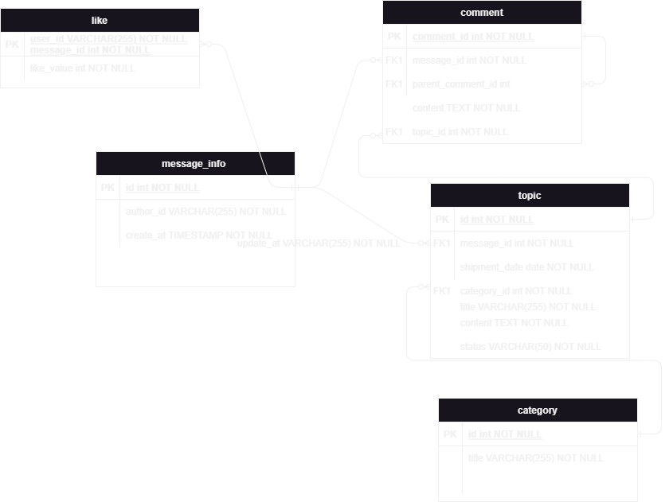

# Приложение TTRPG микросервис forum

## Технологический стек
* Java 21
* Spring Boot 4.x + Spring Data JPA + Spring Web MVC
* PostgreSQL (основная БД)
* Liquibase (миграции схемы)
* Testcontainers (интеграционные тесты)
* Lombok (сокращение шаблонного кода)
* MapStruct (маппинг сущностей ↔ DTO)
* Gradle (Kotlin DSL) – сборка
* Git / GitHub – версионный контроль

## Устройство базы данных



## Работа с базой локально
### Запуск
```shell
cd infra
docker-compose up
```
### Остановка
```shell
cd infra
docker-compose down
```
